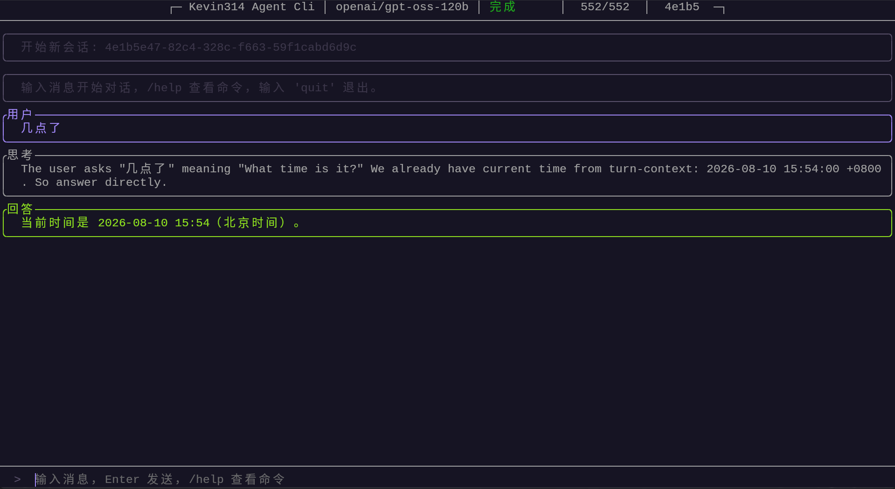
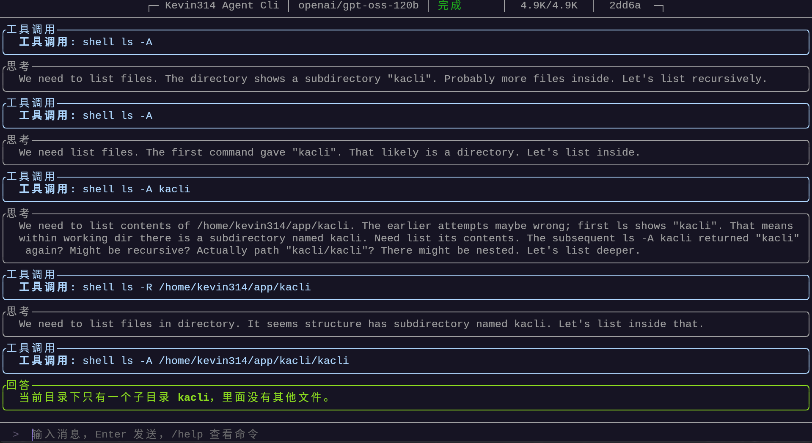
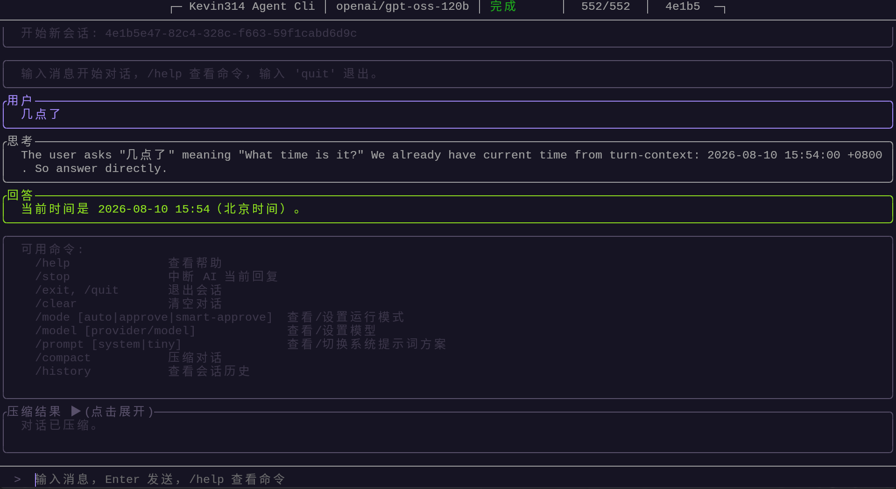

# Kevin314 Agent Cli

一个简单的C++ Agent Cli工具

## 目录

- [目录结构](#目录特性)
- [图片](#图片)
- [来源和关于某些变量名的解释](#来源和关于某些变量名的解释)
- [使用方法](#使用方法)
  - [环境要求](#环境要求)
  - [安装步骤](#安装步骤)
  - [使用方法](#使用方法)
- [遇到bug](#遇到bug)

## 图片

### 单词对话


### 工具调用


### 会话压缩


## 目录结构

- /build-scripts (开发使用的构建脚本)
- /scripts (conan的脚本)
- /src (源代码)
- /termux (termux构建脚本)
- /tests
- /third_party
- /win (win平台构建脚本)
- CmakeLists.txt
- conanfile.py
- LICENSE
- README.md

## 来源和关于某些变量名的解释

起初我希望使用goose项目，但由于rust的内存占用较大并且在我的termux上运行存在问题，所以我决定自己制作一个项目。起初项目名称被命名为goose c++，但后来发现和goose没什么关系，且容易弄混goose和goose c++，因此改名为kacli，所以在项目源代码中，你可以见到大量被名为goose的变量和函数，这是历史遗留问题，现在正在逐步清除。

## 使用方法

### 环境要求

- 操作系统：Linux / Termux / Windows
- 依赖在构建处已标注

### 安装步骤

下载release版本或手动构建

```bash
# 克隆仓库
git clone https://github.com/Kevin31415/kevin314-agent-cli.git
cd ./your_system

# 运行构建脚本
# 确保依赖齐全
./release.sh
```

### 使用方法

```bash
# 帮助列表
kacli help

# 设置提供商地址和模型，支持openai和anthropic格式
kacli configure

# 设置api key
kacli key sk-api-key

# 启动交互式界面
kacli
```

## 遇到bug

等我修可能很慢，你也可以提个issuse。建议还是自己修修或者让自家ai修修吧，修好了记得提个pr。